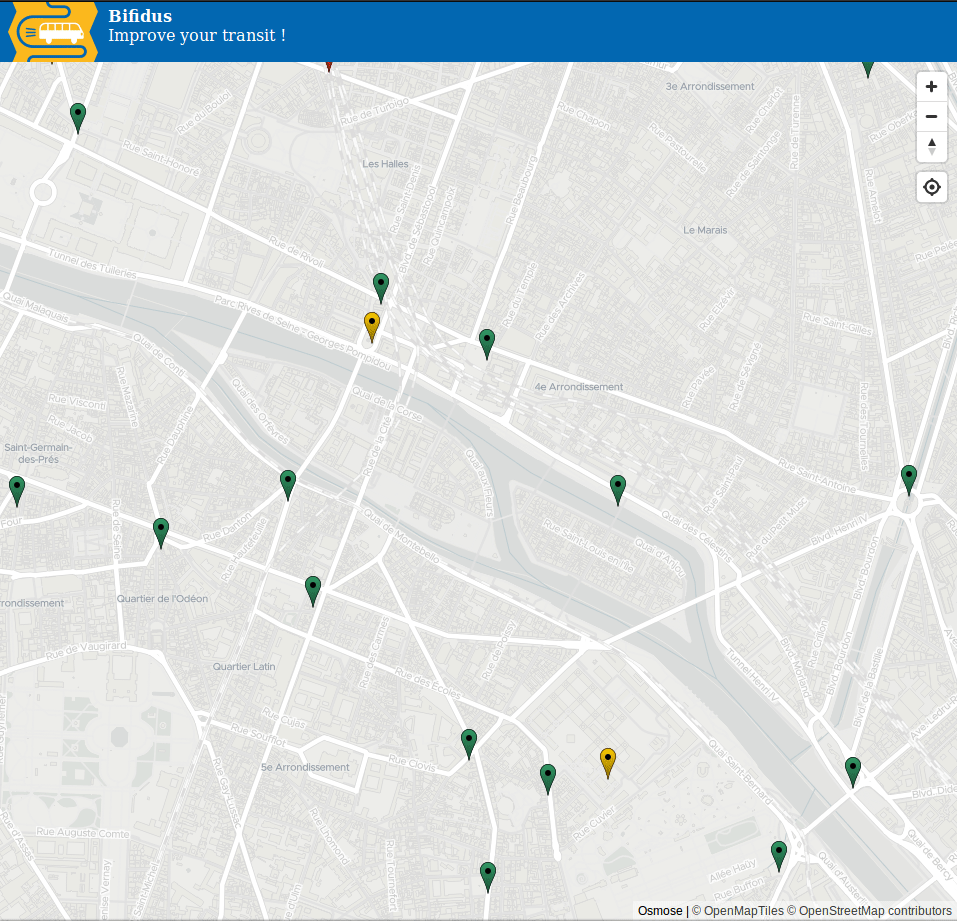

# Bifidus
### Improve your transit

This is a quality assurance tool for transit data in OpenStreetMap.

## License

This project is developed by the [Jungle Bus](https://junglebus.io/) team.

It uses [Osmose](https://osmose.openstreetmap.fr/) issues about public transport as a data source.

The code in this repository is under the MIT license.

If you value this work, show your support by donating to the [OSM French local chapter](https://openstreetmap.fr).
